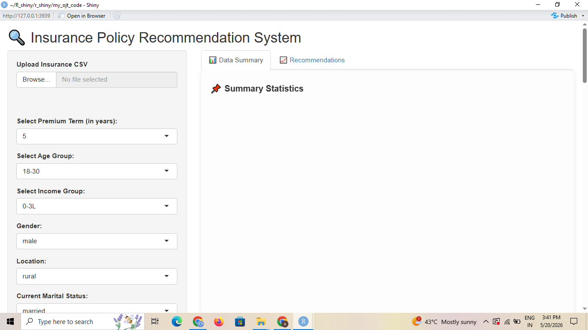
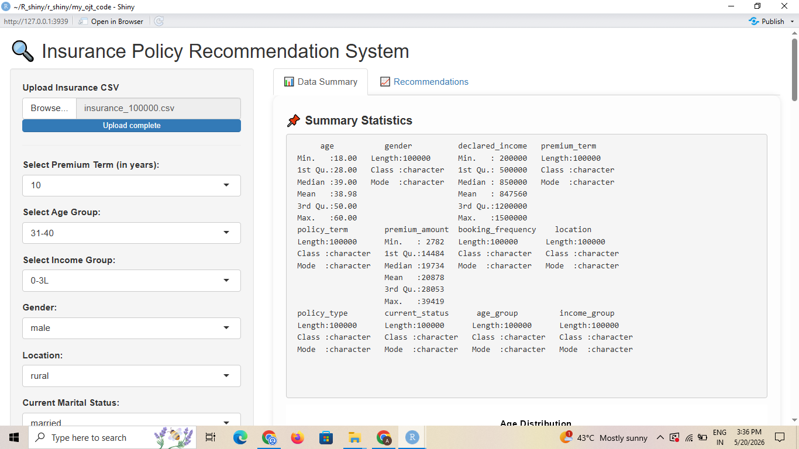
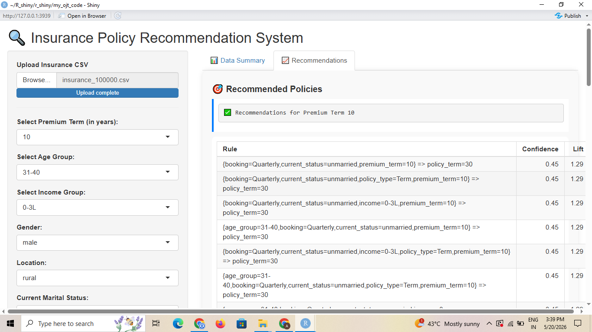

# Insurance Policy Recommendation System using R Shiny

## Overview
This project is an intelligent insurance recommendation system developed using R Shiny and the Apriori Algorithm. The system analyzes customer demographic and financial information to recommend suitable insurance policies.

---

## Features
- Interactive R Shiny Dashboard
- Insurance Policy Recommendation System
- Association Rule Mining using Apriori Algorithm
- Exploratory Data Analysis (EDA)
- Dynamic Customer Filtering
- Synthetic Insurance Dataset Generation
- Recommendation Ranking using Confidence and Lift

---

## Technologies Used
- R Programming
- Shiny
- dplyr
- arules
- ggplot2

---

## Dataset Features
The dataset contains:
- Age
- Gender
- Declared Income
- Premium Term
- Policy Term
- Booking Frequency
- Policy Type
- Customer Status
- Premium Amount

---

## Recommendation Logic
The system applies the Apriori Algorithm to discover hidden relationships between:
- Premium Term
- Policy Term
- Policy Type
- Customer Demographics

Example Rule:

```text
premium_term=10 => policy_term=30
```

---

## Dashboard



---

## Data Summary



---

## Recommendations



---

## How to Run

Install required packages:

```r
install.packages(c(
  "shiny",
  "dplyr",
  "arules",
  "ggplot2"
))
```

Run the application:

```r
shiny::runApp("model/R_shiny_app.R")
```

---

## Future Improvements
- Machine Learning based premium prediction
- Hybrid recommendation system
- User authentication
- Cloud deployment
- Interactive analytics dashboard

---

## Author
Aditya Pardeshi
